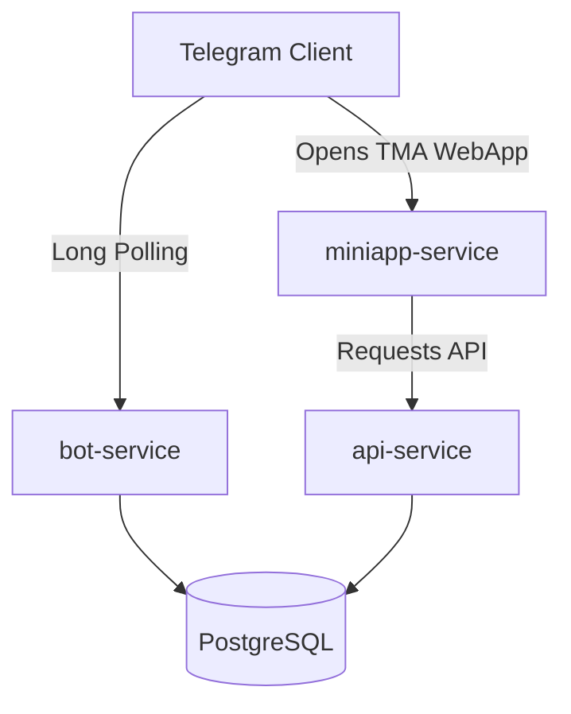

# Railway Multi-Service Deployment Guide

This guide details how to deploy the Telegram support bot, FastAPI backend, and React/Vite frontend as three separate services from the same repository on Railway, using a shared Postgres database.

---

## Architecture Overview

We deploy the monorepo using three Railway services:
1. **`bot-service`:** An aiogram long-polling bot worker (replica count = 1). Runs database migrations.
2. **`api-service`:** A FastAPI backend exposing endpoints for the Telegram Mini App (TMA).
3. **`miniapp-service`:** A static web server serving the compiled React single-page application (SPA).
4. **`Postgres`:** A shared database instance provisioned directly in the Railway project.

---

## 1. Shared Database Setup

1. In your Railway project, click **New** -> **Database** -> **Add PostgreSQL**.
2. Railway will automatically provision a Postgres database and inject `DATABASE_URL` settings.

---

## 2. Deploying `bot-service` (Polling Worker)

1. Click **New** -> **GitHub Repo** and select the repository.
2. Under **Service Settings** -> **General**:
   - **Service Name:** `bot-service`
   - **Build Command:** (leave empty, handled by Dockerfile)
   - **Start Command:** `python -m app.main`
3. Under **Service Settings** -> **Build**:
   - **Dockerfile Path:** `Dockerfile.bot`
4. Under **Settings** -> **Deployments**:
   - **Pre-deploy Command:** `python -m alembic upgrade head` *(Note: Only this service should run database migrations)*
   - **Replicas:** `1` (strict constraint for long-polling bot instance)
5. Add the following environment variables under **Variables**:
   - `APP_ENV`: `production`
   - `DATABASE_URL`: `${{PostgreSQL.DATABASE_URL}}`
   - `BOT_TOKEN`: *[Your Telegram Bot Token]*
   - `OPENROUTER_API_KEY`: *[Your OpenRouter API Key]*
   - `OWNER_ID`: *[Owner's numeric Telegram ID]*
   - `MANAGER_IDS`: *[Initial managers comma-separated Telegram IDs to seed upon deployment]*
   - `DEFAULT_MODEL`: `deepseek/deepseek-v4-flash:free`
   - `AI_HISTORY_LIMIT`: `12`
   - `LOG_LEVEL`: `INFO`
   - `MINIAPP_URL`: *[Will be configured after `miniapp-service` is deployed]*

---

## 3. Deploying `api-service` (FastAPI Backend)

1. In the same project, click **New** -> **GitHub Repo** and select the repository a second time.
2. Under **Service Settings** -> **General**:
   - **Service Name:** `api-service`
   - **Start Command:** `uvicorn app.api.main:app --host 0.0.0.0 --port $PORT`
3. Under **Service Settings** -> **Build**:
   - **Dockerfile Path:** `Dockerfile.api`
4. Under **Settings** -> **Deployments**:
   - **Pre-deploy Command:** (leave empty)
5. Under **Settings** -> **Networking**:
   - Click **Generate Domain** to get a public endpoint (e.g., `https://api-service-production.up.railway.app`). Keep this URL for configuring the frontend.
6. Add the following environment variables under **Variables**:
   - `APP_ENV`: `production`
   - `DATABASE_URL`: `${{PostgreSQL.DATABASE_URL}}`
   - `BOT_TOKEN`: *[Your Telegram Bot Token]*
   - `OWNER_ID`: *[Owner's numeric Telegram ID]*
   - `MANAGER_IDS`: *[Initial managers comma-separated Telegram IDs to seed]*
   - `MINIAPP_SESSION_SECRET`: *[A secure, long, random key. The API will fail fast if this is default or missing in production]*
   - `MINIAPP_AUTH_MAX_AGE_SECONDS`: `86400`
   - `MINIAPP_ORIGIN`: *[Will be configured to match the public URL of the `miniapp-service` once deployed]*
   - `LOG_LEVEL`: `INFO`

---

## 4. Deploying `miniapp-service` (Vite Frontend)

1. In the same project, click **New** -> **GitHub Repo** and select the repository a third time.
2. Under **Service Settings** -> **General**:
   - **Service Name:** `miniapp-service`
3. Under **Service Settings** -> **Build**:
   - **Dockerfile Path:** `Dockerfile.miniapp`
4. Under **Settings** -> **Deployments**:
   - **Pre-deploy Command:** (leave empty)
5. Under **Settings** -> **Networking**:
   - Click **Generate Domain** to get a public endpoint (e.g., `https://miniapp-service-production.up.railway.app`). This is the root URL of your Mini App.
6. Under **Variables**, add:
   - `VITE_API_BASE_URL`: *[The public URL of the `api-service` generated in Step 3 (e.g., `https://api-service-production.up.railway.app`)]*

> [!WARNING]
> Vite embeds `VITE_` variables into the static javascript build bundle.
> Do NOT expose backend credentials or secrets (such as `BOT_TOKEN` or `DATABASE_URL`) to the `miniapp-service`.

---

## 5. Post-Deployment Linkage

Once both public domains are generated:

1. **Configure CORS on API:**
   - Go to `api-service` **Variables** and update `MINIAPP_ORIGIN` to match the public domain of the `miniapp-service` (e.g., `https://miniapp-service-production.up.railway.app`).
2. **Configure launch button in Bot:**
   - Go to `bot-service` **Variables** and update `MINIAPP_URL` to match the public domain of the `miniapp-service` (e.g., `https://miniapp-service-production.up.railway.app`).
   - Redeploy `bot-service` to apply settings.

---

## 6. Configure BotFather Mini App Link

To configure your bot's Mini App launch button within Telegram:
1. Open chat with `@BotFather` in Telegram.
2. Send `/newapp` to create a new Mini App linked to your bot.
3. Select your bot from the list.
4. Set a name and description for your app.
5. Upload the required image assets.
6. When prompted for the URL, enter the public domain of `miniapp-service` (e.g., `https://miniapp-service-production.up.railway.app`).
7. Enter a short name for the app (used as the URL anchor, e.g. `app`).
8. `@BotFather` will output a link resembling: `t.me/your_bot/app`. Use this link as the `MINIAPP_URL` in your bot service configuration to enable the chat keyboard launch button!
